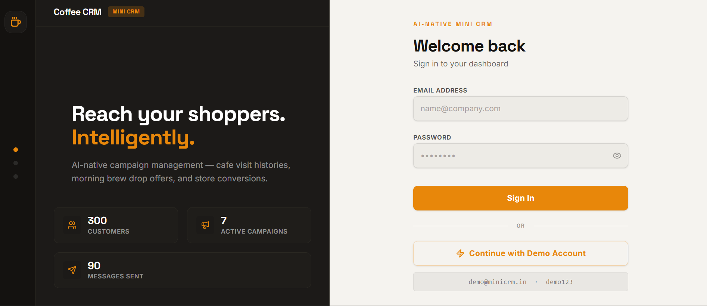
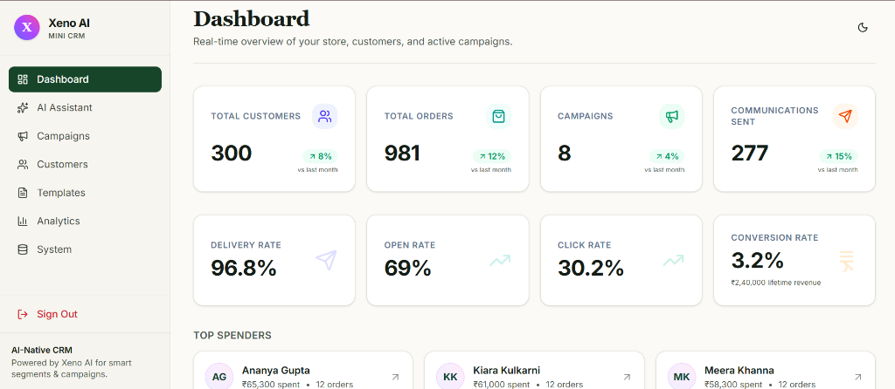
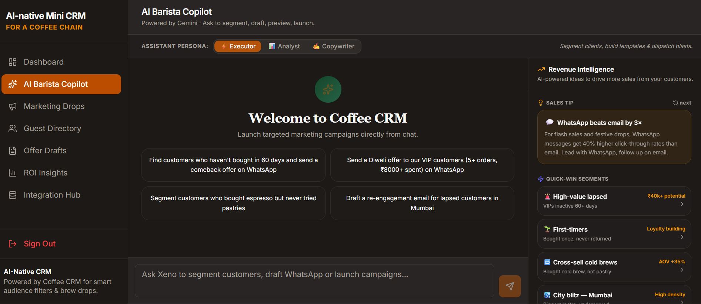
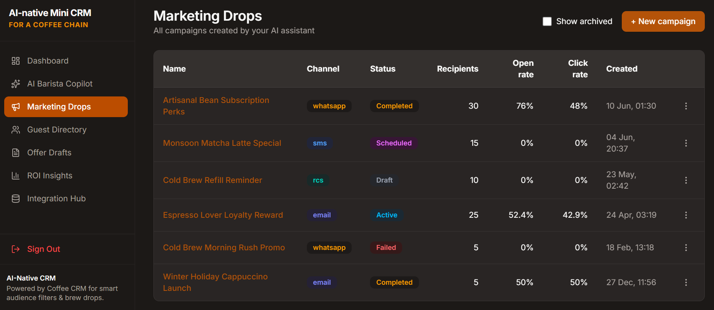
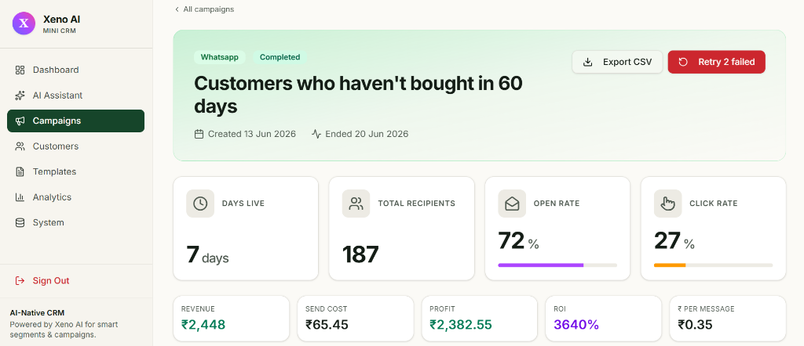
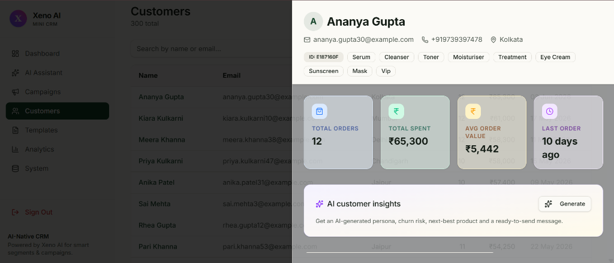
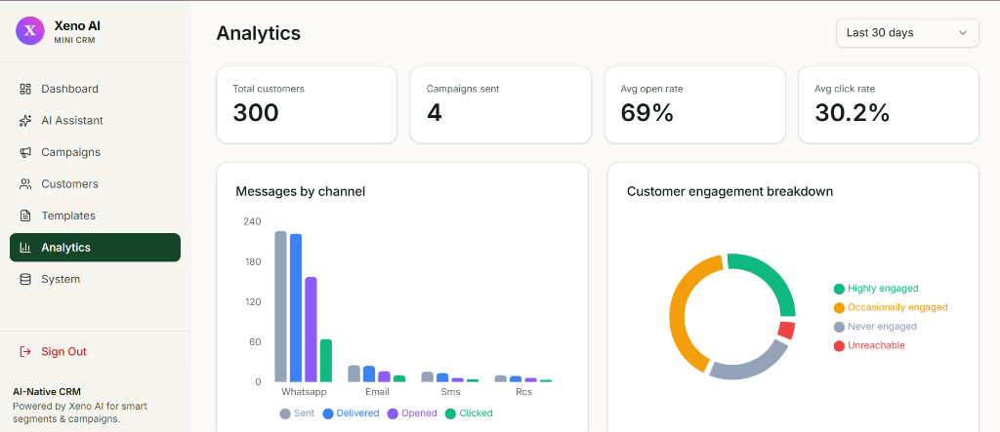

# Xeno AI — MINI CRM

> AI-native campaign management for D2C brands.  
> Built as part of the Xeno Engineering Internship Assignment 2026.

<br/>



<br/>

## 🔗 Links

| | |
|---|---|
| 🌐 **Live Demo** | https://xeno-minicrm.up.railway.app/ |

**Demo credentials**
```
Email:     demo@minicrm.in
Password:  demo123
```

<br/>

---

## What I Built

AI-native Mini CRM for a Coffee Chain is a **chat-first AI-native Shopper CRM** built for a fictional D2C coffee brand. Instead of a traditional dashboard with forms and dropdowns, the primary interface is a natural language conversation. The marketer describes their intent, and the AI segments customers, drafts messages, previews campaigns, and launches them — all from a single chat.

The core product insight: **a marketer should never have to think in SQL or filters.** They should just say what they want.

> *"Send a Diwali offer to customers who bought once but haven't returned in 60 days"*

The AI handles everything from that one sentence.

<br/>

---

## Screenshots

| | |
|---|---|
|  |  |
| **Dashboard** — Live metrics, activity feed, active campaigns | **AI Barista Copilot** — Chat-first campaign creation |
|  |  |
| **Marketing Drops** — Full lifecycle with status tracking | **Marketing Drops Detail** — Live funnel, AI insight, message log |
|  |  |
| **Guest Directory** — Searchable profiles with order history | **ROI Insights** — Channel performance, engagement breakdown |

<br/>

---

## Features

### AI-Native Campaign Creation
- **Natural language segmentation** — describe your audience in plain English, AI converts it to a database query
- **AI message drafting** — generates personalised copy per channel (WhatsApp, SMS, Email, RCS)
- **Campaign preview** — shows 5 personalised message samples before launch
- **One-click launch** — AI confirms and fires the campaign with explicit marketer approval
- **Post-campaign AI insight** — auto-generated 2-sentence performance summary after completion

### Campaign Management
- Full campaign lifecycle: `draft → running → completed / failed`
- Status-aware edit drawer — different editing permissions per campaign status
- Archive system — completed campaigns are archived, not deleted, preserving analytics data
- Real-time status updates via polling — delivery stats update live as callbacks arrive

### Two-Service Channel Architecture
- **CRM service** — manages customers, campaigns, segmentation, and analytics
- **Channel stub service** — separate service that simulates message delivery asynchronously
- Callback-driven loop — stub POSTs delivery events back to CRM receipt API
- Full message lifecycle: `queued → sent → delivered → opened → read → clicked / failed`
- Retry logic — failed messages retry 3 times with exponential backoff (2s, 4s, 8s)
- Realistic delivery simulation with channel-specific outcome rates

### Customer Intelligence
- 500 seeded customers with realistic Indian profiles and purchase history
- Full order history per customer with product-level detail
- Message history — every communication sent to a customer, with status
- Customer segments: VIP, regular, one-time, lapsed — visible as tags

### Analytics
- Engagement funnel across all campaigns
- Channel performance comparison (sent, delivered, opened, clicked per channel)
- Customer engagement breakdown — highly engaged vs never engaged
- Revenue tracking with simulated attribution model
- Date range filtering — last 7 days, 30 days, 3 months, all time

<br/>

---

## Tech Stack

| Layer | Technology | Why |
|---|---|---|
| Frontend | Next.js 14 + TypeScript | File-based routing, SSR, great DX |
| Styling | Tailwind CSS + shadcn/ui | Fast, consistent, accessible components |
| Database | Supabase (PostgreSQL) | Managed Postgres, real-time subscriptions, easy setup |
| AI | Anthropic Claude API (claude-sonnet-4-6) | Tool use / function calling for real actions |
| Queue | BullMQ + Redis | Reliable job queue with retry, backoff, concurrency |
| Channel Stub | Express.js (separate service) | Decoupled from CRM, mirrors real provider architecture |
| Deployment |Railway (frontend + backend + Redis) | Fast, free-tier friendly, production-grade |

<br/>

---

## Architecture

### System Overview

```
┌─────────────────────────────────────────────────────────────┐
│                        MARKETER                             │
│                    (Chat Interface)                         │
└──────────────────────────┬──────────────────────────────────┘
                           │ natural language
                           ▼
┌─────────────────────────────────────────────────────────────┐
│                    CRM BACKEND                              │
│                                                             │
│   ┌─────────────┐    ┌──────────────┐    ┌──────────────┐  │
│   │ Claude API  │    │   BullMQ     │    │  PostgreSQL  │  │
│   │ (Tool Use)  │───▶│  Job Queue   │    │  (Supabase)  │  │
│   └─────────────┘    └──────┬───────┘    └──────────────┘  │
│                             │                               │
└─────────────────────────────┼───────────────────────────────┘
                              │ POST /send
                              ▼
┌─────────────────────────────────────────────────────────────┐
│                  CHANNEL STUB SERVICE                       │
│              (Separate Express server)                      │
│                                                             │
│   Simulates: WhatsApp · SMS · Email · RCS                   │
│   Outcomes:  delivered · opened · read · clicked · failed   │
└──────────────────────────┬──────────────────────────────────┘
                           │ POST /api/receipt (async callback)
                           ▼
                  Signl updates message
                  status + logs event
```

### Campaign Flow

```
Marketer types intent
        │
        ▼
Claude calls segment_customers tool
        │
        ▼
84 matching customers found
        │
        ▼
Claude calls draft_message tool
        │
        ▼
Message template generated
        │
        ▼
Claude calls preview_campaign tool
        │
        ▼
5 personalised previews shown ──▶ Marketer confirms
                                          │
                                          ▼
                               Claude calls launch_campaign
                                          │
                                          ▼
                               84 jobs enqueued in BullMQ
                                          │
                                          ▼
                               Worker POSTs to channel stub
                                          │
                               ┌──────────┴──────────┐
                               │  Async callbacks     │
                               │  2–15s per message   │
                               └──────────┬──────────┘
                                          │
                                          ▼
                               Signl receipt API updates
                               message status + events
                                          │
                                          ▼
                               Dashboard stats update live
```

### Message Status Lifecycle

```
queued ──▶ sent ──▶ delivered ──▶ opened ──▶ clicked
                       │
                    failed ──▶ retrying (up to 3x)
                                   │
                                failed (final)
```

### Channel Delivery Rates (simulated)

| Channel | Delivered | Opened/Read | Clicked | Failed |
|---|---|---|---|---|
| WhatsApp | 88% | 55% (read) | 12% | 12% |
| SMS | 82% | — | 8% | 18% |
| Email | 76% | 22% (open) | 6% | 24% |
| RCS | 85% | 40% (read) | 14% | 15% |

<br/>

---

## Project Structure

```
Xeno/
├── src/
│   ├── components/
│   │   ├── ui/                  # shadcn base components
│   │   ├── layout/              # Sidebar, Header, PageWrapper
│   │   ├── dashboard/           # MetricCard, ActivityFeed, ActiveCampaigns
│   │   ├── campaigns/           # CampaignTable, CampaignDetail, EditDrawer
│   │   ├── customers/           # CustomerTable, CustomerProfile
│   │   ├── ai-assistant/        # ChatWindow, MessageBubble, ToolResultCard
│   │   ├── analytics/           # FunnelChart, ChannelChart, InsightCard
│   │   └── templates/           # TemplateCard, TemplateModal
│   ├── pages/                   # One file per route
│   ├── hooks/                   # useCampaigns, useCustomers, useChat, useAnalytics
│   ├── lib/
│   │   ├── supabase.ts          # Supabase client
│   │   ├── anthropic.ts         # Claude API + 5 tool definitions
│   │   ├── channel-service.ts   # Stub channel service (replace for production)
│   │   └── utils.ts             # formatCurrency, formatDate, cn()
│   ├── types/index.ts           # All TypeScript interfaces
│   └── constants/index.ts       # Channel costs, status colors, routes
├── supabase/
│   ├── schema.sql               # Full database schema
│   └── seed.sql                 # 500 customers, 15 products, 2500 orders
├── scripts/
│   └── seed.js                  # Run with: npm run seed
├── public/
│   └── favicon.svg
├── .env.example                 # All required environment variables
└── README.md
```

<br/>

---

## AI Tool Definitions

The AI layer uses Claude's function calling. Five tools bridge natural language to real database actions:

| Tool | What it does |
|---|---|
| `segment_customers` | Converts natural language description to SQL WHERE clause, returns matching customer count + sample |
| `draft_message` | Generates personalised message copy for the target audience and chosen channel |
| `preview_campaign` | Fetches 5 sample customers from segment, renders personalised message for each |
| `launch_campaign` | Creates campaign record, fetches all matching customers, enqueues one BullMQ job per recipient |
| `get_campaign_stats` | Returns live funnel metrics + AI-generated 2-sentence performance insight |

<br/>

---

## Local Setup

### Prerequisites
- Node.js 18+
- A Supabase project (free tier works)
- Anthropic API key — [console.anthropic.com](https://console.anthropic.com)
- Redis instance — Railway free tier or local

### Steps

```bash
# 1. Clone the repository
git clone [REPO_URL]
cd signl

# 2. Install dependencies
npm install

# 3. Set up environment variables
cp .env.example .env
# Fill in your values in .env

# 4. Set up the database
# Run supabase/schema.sql in your Supabase SQL editor

# 5. Seed the database with demo data
npm run seed
# Seeds: 500 customers, 15 products, 2500 orders, 10 templates

# 6. Start the development server
npm run dev

# Login with: demo@signl.in / demo123
```

### Environment Variables

```env
SUPABASE_URL=                  # Your Supabase project URL
SUPABASE_PUBLISHABLE_KEY=      # Supabase anon/publishable key
SUPABASE_SERVICE_ROLE_KEY=     # Supabase service role key (keep secret)
ANTHROPIC_API_KEY=             # Get from console.anthropic.com
VITE_SUPABASE_URL=             # Same as SUPABASE_URL (for client bundle)
VITE_SUPABASE_PUBLISHABLE_KEY= # Same as SUPABASE_PUBLISHABLE_KEY (for client bundle)
```

<br/>

---

## About

Built by **Nirmit Prasad** for the Xeno Engineering Internship 2026.

Xeno helps consumer brands reach their shoppers in meaningful, data-driven ways. It is a demonstration of what an AI-native CRM could look like — not a traditional tool with AI bolted on, but a product where AI is the primary interface. The name says it all: send the signal that converts.

---

*Submitted June 15, 2026 · nirmitprasad@gmail.com*
